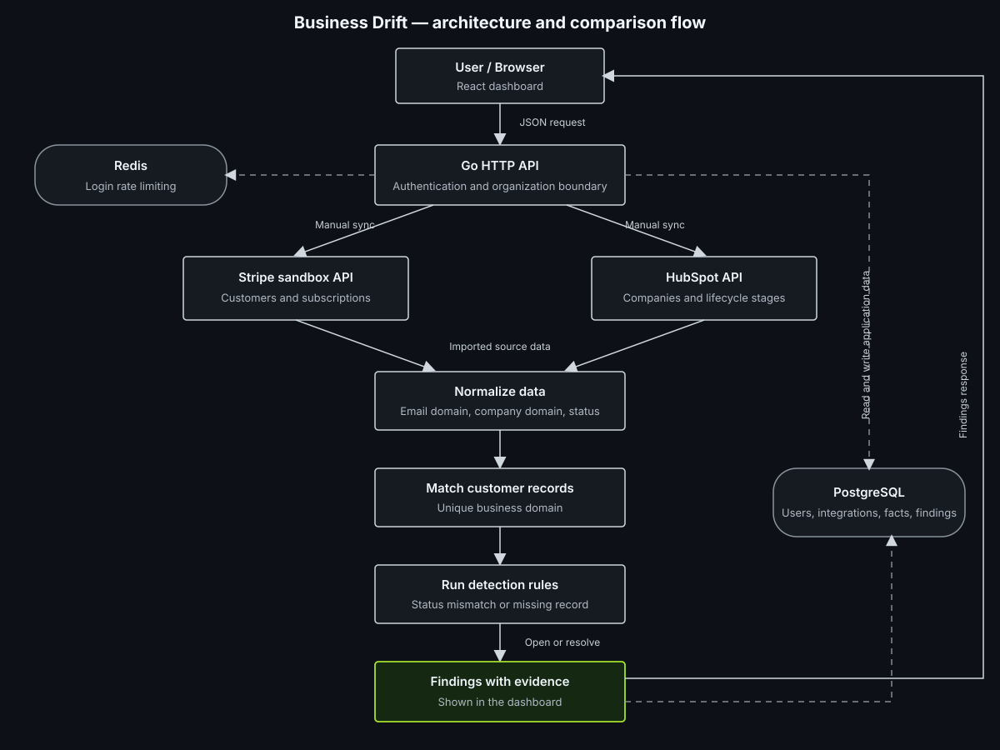

# Business Drift

Business Drift finds customer information that does not match between Stripe and HubSpot.

Stripe tracks billing. HubSpot tracks how a company is classified. If one system changes and the other does not, reports and customer lists can become incorrect.

```text
Stripe subscription: canceled
HubSpot lifecycle stage: Customer

Finding: Acme is canceled in Stripe but active in HubSpot.
```



## What it does

- Connects to Stripe sandbox and HubSpot.
- Imports customers, subscriptions, and companies through background jobs.
- Verifies Stripe and HubSpot webhook signatures and ignores duplicate events.
- Matches Stripe customers with HubSpot companies by business domain.
- Finds status mismatches and customers missing from either system.
- Shows findings with the source values behind them.
- Includes registration, login, roles, and organization-scoped data.

## Run locally

Requirements: Go, Node.js, Docker, Docker Compose, and Make.

```bash
git clone https://github.com/arpitkuriyal/business-drift.git
cd business-drift
make install
make up
make migrate-up
npm run dev --prefix web
```

Open the address printed by Vite. Create a workspace with an organization name, email, and password of at least 12 characters. The first user becomes the owner.

## Connect Stripe and HubSpot

In **Stripe**, add a sandbox API key, create a customer with a business email, and select **Sync Stripe**.

In **HubSpot**, create a private app with `crm.objects.companies.read` access. Add its token in Business Drift and select **Sync HubSpot companies**. Sync Stripe first, then HubSpot. A matching company domain, such as `acme.com`, links `person@acme.com` to the company.

Findings appear under **Findings**. Personal email domains are not matched automatically.

## Webhooks and background jobs

The integration screens show each webhook endpoint. Add the endpoint and signing secret in Stripe or HubSpot, then subscribe to the relevant customer or company changes. Business Drift verifies webhook signatures and queues reconciliation in its background worker. Repeated event IDs are ignored, and failed jobs retry after 30 seconds.

For Stripe, subscribe to `customer.subscription.created`, `customer.subscription.updated`, and `customer.subscription.deleted`. In HubSpot, subscribe to company changes and provide the app secret in the HubSpot settings form.

Webhook setup requires a public backend URL. For local Stripe testing, run:

```bash
stripe listen --events customer.subscription.created,customer.subscription.updated,customer.subscription.deleted \
  --forward-to localhost:8080/api/v1/webhooks/stripe/<integration-id>
```

Use the `whsec_...` secret printed by Stripe CLI. Never use a live Stripe key or real card for the demo.

## Configuration

| Variable | Local default | Purpose |
| --- | --- | --- |
| `APP_ENV` | `development` | Runtime mode: `development`, `test`, or `production` |
| `HTTP_ADDRESS` | `:8080` | Address and port used by the API |
| `DATABASE_URL` | Local PostgreSQL connection | PostgreSQL connection string |
| `REDIS_URL` | `redis://localhost:6379/0` | Redis connection string |
| `ENCRYPTION_KEY` | Development-only key | Base64-encoded 32-byte key used to encrypt integration credentials |

For production, set `APP_ENV=production` and provide `DATABASE_URL`, `REDIS_URL`, and `ENCRYPTION_KEY` explicitly. Docker Compose supplies the local defaults.

Generate a 32-byte encryption key with:

```bash
openssl rand -base64 32
```

The frontend can use `VITE_API_URL` in `web/.env` when the API is hosted separately. See `web/.env.example`.

## API routes

| Method | Path | Purpose |
| --- | --- | --- |
| `POST` | `/api/v1/auth/register` | Create a workspace and owner |
| `POST` | `/api/v1/auth/login` | Sign in |
| `POST` | `/api/v1/auth/refresh` | Refresh the session |
| `POST` | `/api/v1/auth/logout` | Sign out |
| `GET` | `/api/v1/auth/me` | Read the signed-in identity |
| `GET` | `/api/v1/organization` | Read the current workspace |
| `GET` | `/api/v1/integrations/stripe` | Read Stripe connection status |
| `POST` | `/api/v1/integrations/stripe` | Save a Stripe key and optional webhook secret |
| `POST` | `/api/v1/integrations/stripe/sync` | Queue a Stripe sync |
| `GET` | `/api/v1/integrations/hubspot` | Read HubSpot connection status |
| `POST` | `/api/v1/integrations/hubspot` | Save a HubSpot token and optional app secret |
| `POST` | `/api/v1/integrations/hubspot/sync` | Queue a HubSpot sync |
| `POST` | `/api/v1/webhooks/stripe/{integrationID}` | Receive signed Stripe events |
| `POST` | `/api/v1/webhooks/hubspot/{integrationID}` | Receive signed HubSpot events |
| `GET` | `/api/v1/integration-jobs/{id}` | Read a job status |
| `GET` | `/api/v1/findings` | List findings |
| `GET` | `/api/v1/findings/{id}` | Read a finding and its evidence |
| `GET` | `/health`, `/live` | Check that the API is running |
| `GET` | `/ready` | Check the API and its dependencies |

Authenticated routes use `Authorization: Bearer <token>`. Owners and admins can update integrations and start syncs.

## Useful commands

```bash
make test
make lint
make build
make ci
make down
```

## License

Licensed under the [MIT License](LICENSE).
